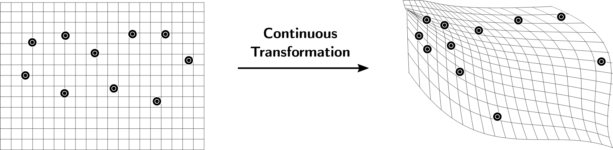
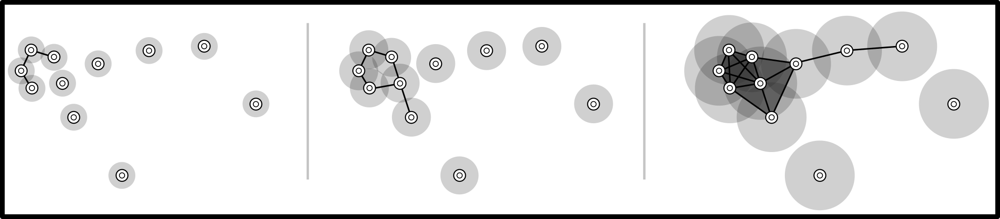
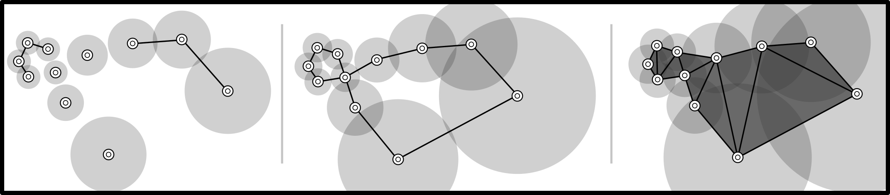

# Uniform Distributed Persistent Homology (UDiPH)


[](https://pepy.tech/project/udiph) [](https://github.com/Antonio-Leitao/dbsampler/blob/main/LICENSE) [](https://github.com/Antonio-Leitao) [](https://pypi.org/project/udiph/) [](https://www.python.org/)

UDiPH is a package that creates a new metric space where the points are uniformly sampled with respect to a global metric. It is oriented for creating Vietoris-Rips filtrations that are independent of the metric of the initial space. This work is very influced on [UMAP](https://github.com/lmcinnes/umap).

UDiPH excells when comparing homology of spaces with different metrics, for example consider a continuous deformation acting on a set of points:
<p align="center">
  
</p>

Standard Vietoris-Rips filtration:
<p align="center">
  
</p>
Vietoris-Rips filtration using metric space created by UDiPH is based on local density:
<p align="center">
  
</p>
Since we are in the presence of a continuous deformation it is expected that the homology remains invariant. However due to the difference in metric in the image space, the standard Vietoris-Rips filtration does not accuratly capture this invariance. Notice how a filtration using UDiPH manages to capture both homology generators.

## Installation
Dependencies:
  - Numpy
  - Scipy
  - Sklearn

UDIPH is available on PyPI,

```sh
pip install udiph
```
## Usage
```python
import udiph
M = udiph.UDIPH(X=X, n_neighbors=15, distance_matrix=False, return_complex=False)
```
**Parameters:**
-  ``X``: numpy array of shape=(samples,features) or shape=(samples,samples) containing the data. If data is a pairwise distance matrix then ``distance_matrix`` must be set to True.
 -  ``n_neighbors``: number of nearest neighbors considered when creating the proximity graph. Too many and topological features are dissolved, too few are artifacts are created. Fairly robust.
 -  ``distance_matrix``: Boolean value indicating if input data is or not a distance_matrix 
 -  ``return_complex``: Boolean value indicating whether to return the weighted 1-d simplicial complex instead of a pairwise distance matrix.
 
**Returns:**
 -  ``M``: numpy array (samples, samples) pairwise distance matrix with respect to new Riemannian metric.
 -  ``A``: (optional) numpy array (samples, samples) adjacency matrix of the weighted 1-d simplicial complex.

## How does it work?
The basic assumption on UDiPh relies on the idea that data comes uniformly sampled from an unknown Riemmannian manifold. As a consequence, "bigger" holes in the governing manifold are respresented by having a higher number of points sampled from their boundary, and "small" holes will have less points sampled.
 
## Citation
If you use UDiPH in your work or parts of the algorithm please consider citing:
> Paper coming soon
